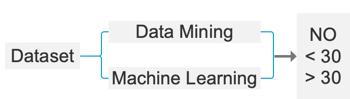
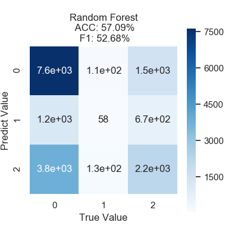
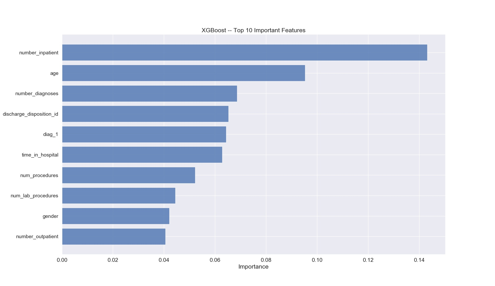
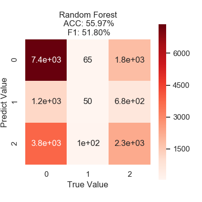
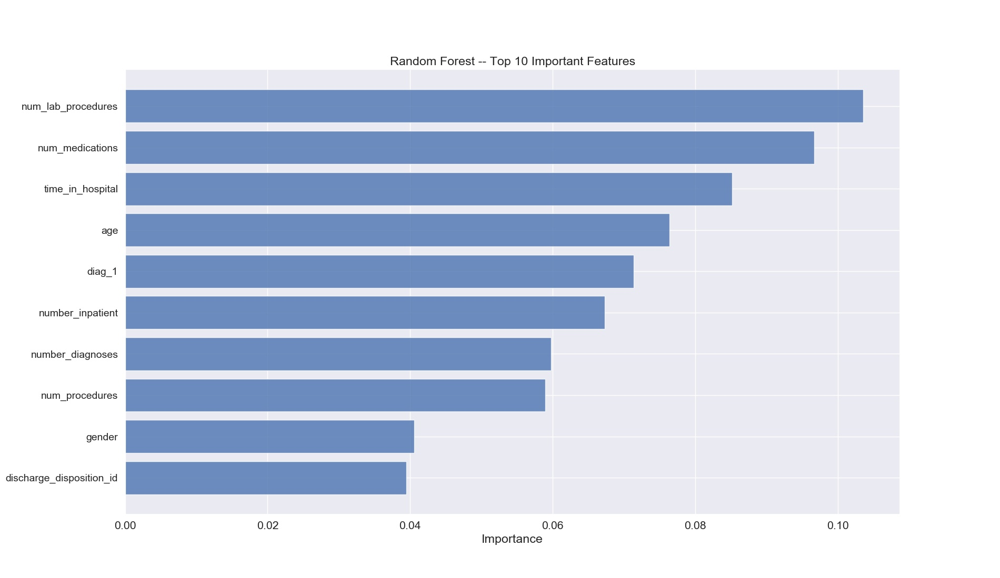

# Readmission Prediction

[](https://awesome.re)


[](https://app.fossa.io/projects/git%2Bgithub.com%2Ffreesinger%2Freadmission_prediction?ref=badge_shield)

## 1. Dependencies

`python>=3.6`

Libraries:
```
- numpy
- pandas
- scipy
- imbalanced-learn
- seaborn
- XGBoost
- scikit-learn
- matplotlib
```

## 2. Datasets

Raw dataset `Diabetes 130-US hospitals for years 1999-2008 Data Set` can be found [hear](https://archive.ics.uci.edu/ml/datasets/Diabetes+130-US+hospitals+for+years+1999-2008#).
The dataset represents 10 years (1999-2008) of clinical care at 130 US hospitals and integrated delivery networks. It includes over 50 features representing patient and hospital outcomes. Information was extracted from the database for encounters that satisfied the following criteria. 

> (1) It is an inpatient encounter (a hospital admission).
> 
> (2) It is a diabetic encounter, that is, one during which any kind of diabetes was entered to the system as a diagnosis.
> 
> (3) The length of stay was at least 1 day and at most 14 days.
> 
> (4) Laboratory tests were performed during the encounter.
> 
> (5) Medications were administered during the encounter. The data contains such attributes as patient number, race, gender, age, admission type, time in hospital, medical specialty of admitting physician, number of lab test performed, HbA1c test result, diagnosis, number of medication, diabetic medications, number of outpatient, inpatient, and emergency visits in the year before the hospitalization, etc.

## 3. Files

Readmission prediction task can be concluded by the figure below:



`preprocess.py`: used for preprocessing data, generate the processed data file `preprocessed_data.csv` which saved in folder `data`.

`train.py`: used for training and output, test models are `XGBoost` and `Random Forest`. Accuracy, confusion matrix and overall report of models will shown after running.

## 4. Usage

```
>_ python3.6 preprocess.py
>_ python3.6 train.py
```

## 5. Performances

### XGBoost

Confusion matrix:



Top 10 importent features:



### Random Forest

Confusion matrix:



Top 10 important features:



## 6. License

[](https://app.fossa.io/projects/git%2Bgithub.com%2Ffreesinger%2Freadmission_prediction?ref=badge_large)
