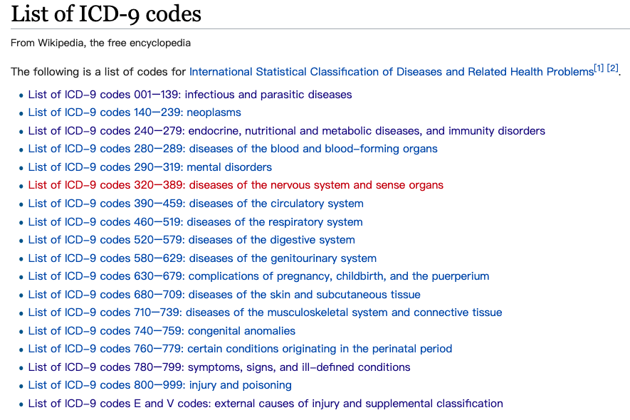
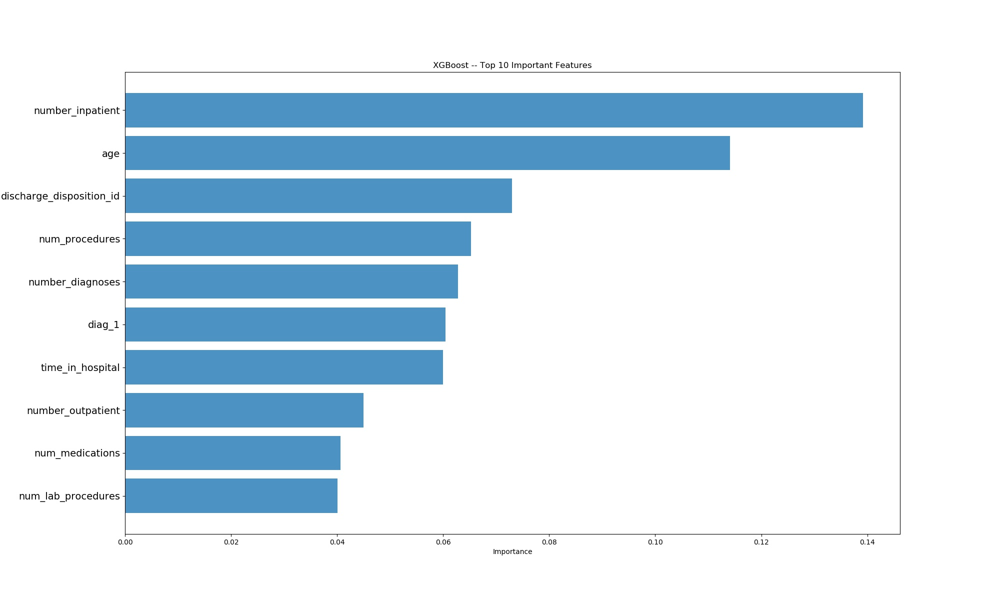
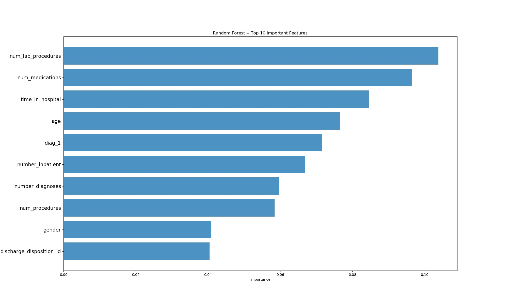

# Readmission Prediction

## 1. 任务描述

在给定的数据集上采用合适的数据挖掘/机器学习算法，预测病人是否会在短时间内再入院。该任务可以看成是一个多分类问题，根据数据特征，将数据分成三类：

`"NO"、"<30"、" >30"`

## 2. 数据集描述

**Diabetes 130-US hospitals for years 1999-2008 Data Set**

该数据集中包含了1999年~2008年这10年期间美国130家医院等的临床信息，其中这些数据都满足以下条件：

- 都是住院病人

- 都是糖尿病患者

- 逗留时间至少为1天，最多14天

- 在期间进行了相应的测试以及药物治疗。

数据中包含了例如种族，性别之类的等属性。

## 3. 数据预处理

### **(1) 丢弃数据**

| 类型       | 介绍                                    |
|:--------:|:-------------------------------------:|
| >40% 缺失率 | weight, payer_code, medical_specialty |
| 单值数据     | examide, citoglipton                  |
| 性别未知     | Gender is Unknown/Invalid             |
| 无有效诊断信息  | 3 diagnose value all missing          |
| 死亡病人     | ‘Expired’ patients never readmit      |

### **(2) 特征处理**

- **简化**

根据`IDs_mapping`文件中提供的对如下三种类别的定义，简化方案如下：

| 类别                         | 映射                                                                                                 |
|:--------------------------:|:--------------------------------------------------------------------------------------------------:|
| admission\_type\_id        | \[2, 7\] →  1, \[6, 8\] → 5                                                                        |
| discharge\_disposition\_id | \[6, 8, 9, 13\] →  1, \[3, 4, 5, 14, 22, 23, 24\] →  2, \[12, 15, 16, 17\] →  10, \[25, 26\] →  18 |
| admission\_source\_id      | \[3, 2\] →  1, \[13, 14\] →  11, \[15, 17, 20, 21\] →  9, \[5, 6, 10, 22, 25\] →  4                |

- **归类**

  创建了两个新的特征：

`num_med_changed:` 记录23种药物用量改变的总次数

`num_med_taken:` 记录23中药物服用过的种类数

- **~~合并入院次数~~**

`number_outpatient,  number_emergency, number_inpatient`三个特征分别代表病人入院原因，分为已入院，急症和门诊入院三种。创建新特征为`number_treatment:`用来代表别人入院总次数。

但经过讨论之后，我们认为入院类型可能对病人再入院的判断有一定影响，譬如急症入院次数多的病人再入院的概率肯定会比一般病人高一些，因此这个特征合并最终未被采用。

### **(3) 重编码**

这部分工作主要是对非数值类型的数据重编码，方便输入模型进行训练，如下示例代码是对种族的重编码，具体方案见`preprocess.py`。

```python
# encode race
df['race'] = df['race'].replace('Asian', 0)
df['race'] = df['race'].replace('AfricanAmerican', 1)
df['race'] = df['race'].replace('Caucasian', 2)
df['race'] = df['race'].replace('Hispanic', 3)
df['race'] = df['race'].replace('Other', 4)
df['race'] = df['race'].replace('?', 4)
```

该部分比较难处理的是对诊断信息进行分类，根据所给资料由ICD-9将诊断信息分为共19类。



### (4) 标准化

由于数值差异较大，对数据进行标准化使其服从标准正态分布。

## 4. 模型选择

其实这个实验的主要任务都是在之前数据清洗和预处理阶段，模型训练阶段只需要根据预处理后的数据选用相应的模型进行训练即可。

在之前预处理后得到的数据上，我们在训练过程中还直接将`encounter_id`、`patient_nbr`、`diag_2`、`diag_3`这四个特征列也删去了。

预处理后的数据中总共有 86556 个，其中每类样本数如下：

```undefined
>30 readmmission 30708
<30 readmmission 9399
Never readmmission 46449
```

可以看到这三类样本分布并不是很均匀，所以在划分训练/测试数据之前，我们还采用了`smote`算法进行了采样（over-sampling），从而得到最终的训练/测试数据，最终采样后得到数据数为 39347 个，我们按照 $4 : 1$ 的比例进行训练/测试集的划分，最终训练数据集样本数有 11477 个，测试集样本数 27870 个。

我们最终采用了两种方法处理这个三分类问题，分别是**XGboost**和**Random Forest**算法，并进行了10-fold 交叉验证。实验结果如下：

## 5. 模型训练

### XGboost

```shell
Cross Validation score:  0.5983204189278923
Accuracy:  0.5709334565619224
Confusion matrix: 
 [[7624  106 1526]
 	[1186   58  670]
 	[3806  134 2202]]
Overall report: 
               precision    recall  f1-score   support

           0       0.60      0.82      0.70      9256
           1       0.19      0.03      0.05      1914
           2       0.50      0.36      0.42      6142

   micro avg       0.57      0.57      0.57     17312
   macro avg       0.43      0.40      0.39     17312
weighted avg       0.52      0.57      0.53     17312
```

在测试集上的准确率是 **57.09%**，MACRO-F1值为 **0.39**。

同时，我们借助 scikit-learn 的`feature_importances_`对用于训练数据中的特征值重要性进行了排序，对于XGboost的算法的结果如下：



### Random Forest

```shell
Cross Validation Score:  0.6702715759718814
Accuracy:  0.5620378927911276
Confusion matrix: 
 [[7347   76 1833]
 	[1181   53  680]
 	[3723   89 2330]]
Overall report: 
               precision    recall  f1-score   support

           0       0.60      0.79      0.68      9256
           1       0.24      0.03      0.05      1914
           2       0.48      0.38      0.42      6142

   micro avg       0.56      0.56      0.56     17312
   macro avg       0.44      0.40      0.39     17312
weighted avg       0.52      0.56      0.52     17312
```

在测试集上的准确率是 **56.20%**，MACRO-F1的值是**0.39**。

`feature_importances_`对于Random Forest的算法的结果如下：



## 总结

在借助机器学习算法进行数据分析的过程中，往往数据清洗和预处理的工作更加关键与繁琐。最后的模型的预测结果瓶颈在于对<30的预测准确率极低，可能因为样本数据中该类数据与其他两种类别相比太少。
