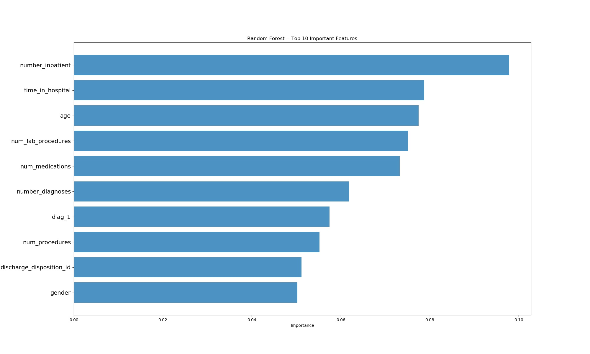

# Readmission Prediction

## 1. 任务描述

在给定的数据集上采用合适的数据挖掘/机器学习算法，预测病人是否会在短时间内再入院。该任务可以看成是一个多分类问题，根据数据特征，将数据分成三类：

`"NO"、"<30"、" >30"`

## 2. 数据集描述

**Diabetes 130-US hospitals for years 1999-2008 Data Set**

该数据集中包含了1999年~2008年这10年期间美国130家医院等的临床信息，其中这些数据都满足以下条件：

- 都是住院病人

- 都是糖尿病患者

- 逗留时间至少为1天，最多14天

- 在期间进行了相应的测试以及药物治疗。

数据中包含了例如种族，性别之类的等属性。

## 3. 数据预处理

- **丢弃数据**

| 类型       | 介绍                                    |
|:--------:|:-------------------------------------:|
| >40% 缺失率 | weight, payer_code, medical_specialty |
| 单值数据     | examide, citoglipton                  |
| 性别未知     | Gender is Unknown/Invalid             |
| 无有效诊断信息  | 3 diagnose value all missing          |
| 死亡病人     | ‘Expired’ patients never readmit      |

- **特征工程**

|     |     |     |
| --- | --- | --- |
|     |     |     |
|     |     |     |
|     |     |     |

## 4. 模型选择

其实这个实验的主要任务都是在之前数据清洗和预处理阶段，模型训练阶段只需要根据预处理后的数据选用相应的模型进行训练即可。

在之前预处理后得到的数据上，我们在训练过程中还直接将`encounter_id`、`patient_nbr`、`diag_2`、`diag_3`这四个特征列也删去了。

预处理后的数据中总共有 86556 个，其中每类样本数如下：

```undefined
>30 readmmission 30708
<30 readmmission 9399
Never readmmission 46449
```

可以看到这三类样本分布并不是很均匀，所以在划分训练/测试数据之前，我们还采用了`smote`算法进行了采样（over-sampling），从而得到最终的训练/测试数据，最终采样后得到数据数为 39347 个，我们按照 $4 : 1$ 的比例进行训练/测试集的划分，最终训练数据集样本数有 11477 个，测试集样本数 27870 个。

我们最终采用了两种方法处理这个三分类问题，分别是**xgboost**和**Random Forest**算法，并进行了10-fold 交叉验证。实验结果如下：

## 5. 模型训练

### XGboost

```shell
Cross Validation score:  0.6083765322410007
Accuracy:  0.6102260495156082
Confusion matrix:
 [[7538  136 1584]
 [1348 6495 1494]
 [3913 2388 2974]]
Overall report：
               precision    recall  f1-score   support

           0       0.59      0.81      0.68      9258
           1       0.72      0.70      0.71      9337
           2       0.49      0.32      0.39      9275

   macro avg       0.60      0.61      0.59     27870
```

在测试集上的准确率是 **60.83%**，MACRO-F1的值是 **0.59**。

同时，我们借助 scikit-learn 的`feature_importances_`对用于训练数据中的特征值重要性进行了排序，对于XGboost的算法的结果如下：


### Random Forest

```shell
Cross Validation Score:  0.6695190654163217
Accuracy:  0.6732328668819519
Confusion matrix: 
 [[7324   66 1868]
 [1111 7488  738]
 [3571 1753 3951]]
Overall report: 
               precision    recall  f1-score   support

           0       0.61      0.79      0.69      9258
           1       0.80      0.80      0.80      9337
           2       0.60      0.43      0.50      9275

   macro avg       0.67      0.67      0.66     27870
```

在测试集上的准确率是 **67.32%**，MACRO-F1的值是**0.66**。

`feature_importances_`对于Random Forest的算法的结果如下：



## 总结

在借助机器学习算法进行数据分析的过程中，往往数据清洗和预处理的工作更加关键与繁琐。
